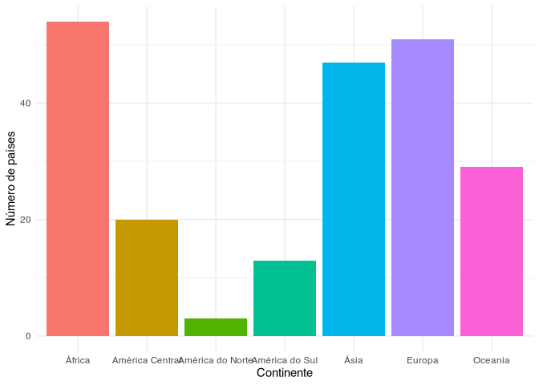

<!-- README.md is generated from README.Rmd. Please edit that file -->

# continentesBR <a href='https://github.com/brunomontezano/continentesBR/'></a>

<!-- badges: start -->
<!-- badges: end -->

## Resumo

O objetivo deste pacote é adquirir os dados contidos em páginas da
Wikipedia, BrasilEscola e SportHistoire e, então, disponibilizar de
forma acessível para quem quiser uma tabela limpa rapidamente.

## Instalação

Você pode instalar a última versão do pacote `continentesBR` através do
seguinte código:

``` r
# install.packages("remotes")
remotes::install_github("brunomontezano/continentesBR")
```

## Exemplo

Este é o exemplo de uso da única função presente na versão atual do
pacote:

``` r
# Caso prefira não carregar o pacote, utilizar como continentesBR::gerar_tabela()
library(continentesBR)
gerar_tabela()
#> # A tibble: 217 × 3
#>    pais              capital          continente      
#>    <chr>             <chr>            <chr>           
#>  1 Canadá            Ottawa           América do Norte
#>  2 Estados Unidos    Washington D.C.  América do Norte
#>  3 México            Cidade do México América do Norte
#>  4 Antígua e Barbuda Saint John's     América Central 
#>  5 Bahamas           Nassau           América Central 
#>  6 Barbados          Bridgetown       América Central 
#>  7 Belize            Belmopan         América Central 
#>  8 Costa Rica        São José         América Central 
#>  9 Cuba              Havana           América Central 
#> 10 Dominica          Roseau           América Central 
#> # … with 207 more rows
```

Com os dados adquiridos, podemos exportar para quaisquer arquivos
desejados ou também realizar qualquer manipulação posterior que se faça
necessária:

``` r
library(magrittr)
gerar_tabela() %>%
  dplyr::count(continente) %>% 
  ggplot2::ggplot() +
  ggplot2::aes(x = continente, y = n, fill = as.factor(continente)) +
  ggplot2::geom_col() +
  ggplot2::theme_minimal() +
  ggplot2::theme(legend.position = "none") +
  ggplot2::labs(x = "Continente", y = "Número de países") +
  ggplot2::coord_flip()
```


