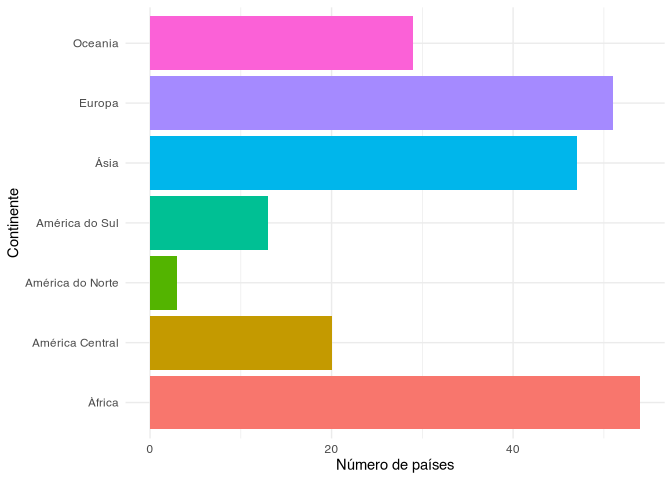
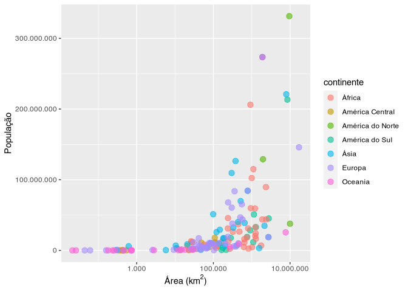

<!-- README.md is generated from README.Rmd. Please edit that file -->

# continentesBR <a href='https://github.com/brunomontezano/continentesBR/'></a>

<!-- badges: start -->

[](https://github.com/brunomontezano/continentesBR/actions)
[](https://travis-ci.com/brunomontezano/continentesBR)
<!-- badges: end -->

## Resumo

O objetivo deste pacote é adquirir os dados contidos em páginas da
Wikipedia, BrasilEscola e SportHistoire e, então, disponibilizar de
forma acessível para quem quiser uma tabela limpa sobre dados
geográficos dos países rapidamente, em português brasileiro.

## Instalação

Você pode instalar a última versão do pacote `continentesBR` através do
seguinte código:

``` r
# install.packages("remotes")
remotes::install_github("brunomontezano/continentesBR")
```

## Exemplo

Este é o exemplo de função presente na atual versão do pacote, usada
para gerar uma tabela (`tibble`) com nomes de países, capitais,
continentes, área em km<sup>2</sup>, população e densidade populacional:

``` r
# Caso prefira não carregar o pacote, utilizar como continentesBR::gerar_tabela()
library(continentesBR)
gerar_tabela()
#> # A tibble: 217 × 9
#>    pais   capital  continente posicao_pop     pop data_pop posicao_area area_km2
#>    <chr>  <chr>    <chr>            <int>   <dbl>    <int>        <int>    <dbl>
#>  1 Canadá Ottawa   América d…          39  3.77e7     2020            2  9984670
#>  2 Estad… Washing… América d…           3  3.31e8     2020            4  9525017
#>  3 México Cidade … América d…          10  1.29e8     2020           13  1964375
#>  4 Antíg… Saint J… América C…         184  9.79e4     2020          182      440
#>  5 Baham… Nassau   América C…         171  3.93e5     2020          156    13878
#>  6 Barba… Bridget… América C…         174  2.87e5     2020          183      430
#>  7 Belize Belmopan América C…         170  3.98e5     2020          148    22965
#>  8 Costa… São José América C…         120  5.09e6     2020          126    51100
#>  9 Cuba   Havana   América C…          82  1.13e7     2020          104   110861
#> 10 Domin… Roseau   América C…          NA NA            NA          172      751
#> # … with 207 more rows, and 1 more variable: dens_pop <dbl>
```

Podemos exportar a tabela para o nosso computador através dos argumentos
`salvar` e `formato`:

``` r
# Como comentado anteriormente, pode-se utilizar a função através dos "::"
# Neste exemplo, a tibble será salva em um arquivo
# chamado "tabela_continentes.xlsx" no diretório de trabalho atual
continentesBR::gerar_tabela(salvar = TRUE, formato = "excel")
```

Ou também realizar qualquer manipulação ou visualização posterior que se
faça necessária:

``` r
# Quantos países existem em cada continente?
library(magrittr)
gerar_tabela() %>%
  dplyr::count(continente) %>% 
  ggplot2::ggplot() +
  ggplot2::aes(x = continente, y = n, fill = as.factor(continente)) +
  ggplot2::geom_col() +
  ggplot2::theme_minimal() +
  ggplot2::theme(legend.position = "none") +
  ggplot2::labs(x = "Continente", y = "Número de países") +
  ggplot2::coord_flip()
```



``` r
# Existe associação entre área e tamamnho da população?
gerar_tabela() %>% 
  dplyr::filter(pop < 1e9 & !is.na(area_km2)) %>% 
  ggplot2::ggplot() +
  ggplot2::aes(x = area_km2, y = pop, color = continente) +
  ggplot2::geom_point(size = 3, alpha = 0.6) +
  ggplot2::scale_x_log10(label = scales::label_number(
    big.mark = ".", decimal.mark = ",")) +
  ggplot2::scale_y_continuous(label = scales::label_number(big.mark = ".",
    decimal.mark = ",")) +
  ggplot2::labs(x = bquote("Área (km"^2*")"),
    y = "População",
    color = "Continente") +
  ggplot2::theme_minimal()
```



## Agradecimentos

Agradeço ao designer [Guilherme
Bueno](https://guilhermebuenodesign.github.io/) pela elaboração do logo
do pacote.
