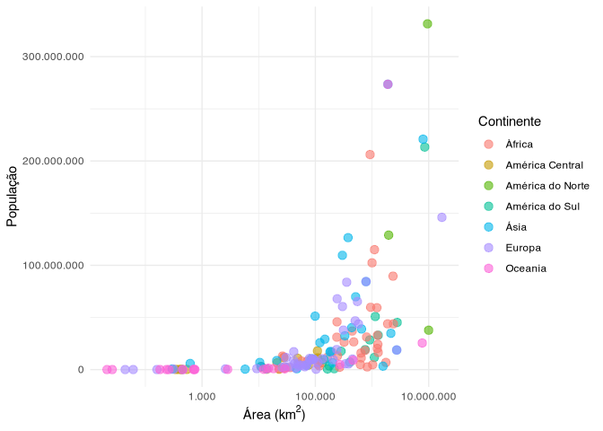

<!-- README.md is generated from README.Rmd. Please edit that file -->

# continentesBR <a href='https://github.com/brunomontezano/continentesBR/'></a>

<!-- badges: start -->

[](https://github.com/brunomontezano/continentesBR/actions)
[](https://travis-ci.com/brunomontezano/continentesBR)
<!-- badges: end -->

## Resumo / Overview

O objetivo deste pacote é adquirir os dados contidos em páginas da
Wikipedia, BrasilEscola e SportHistoire e, então, disponibilizar de
forma acessível para quem quiser uma tabela limpa sobre dados
geográficos dos países rapidamente, em português brasileiro.

The purpose of this package is to acquire the data contained in pages
from Wikipedia, BrasilEscola and SportHistoire and then make it
accessible to anyone who wants a clean table of countries’ geographic
data quickly, in Brazilian Portuguese.

## Instalação / Installation

Você pode instalar a última versão do pacote `continentesBR` através do
seguinte código:

You can install the latest version of the `continentesBR` package via
the following code:

``` r
# install.packages("remotes")
remotes::install_github("brunomontezano/continentesBR")
```

## Exemplos / Examples

Este é o exemplo de função presente na atual versão do pacote, usada
para gerar uma tabela (`tibble`) com nomes de países, capitais,
continentes, área em km<sup>2</sup>, população e densidade populacional:

This is the example of a function present in the current version of the
package, used to generate a table (`tibble`) with names of countries,
capitals, continents, area in km<sup>2</sup>, population and population
density (function name in english would mean `generate_table()`):

``` r
# Caso prefira não carregar o pacote, utilizar como continentesBR::gerar_tabela()

# If you prefer not to load the package, use as continentsBR::gerar_tabela() 
library(continentesBR)
gerar_tabela()
#> # A tibble: 217 × 9
#>    pais   capital  continente posicao_pop     pop data_pop posicao_area area_km2
#>    <chr>  <chr>    <chr>            <int>   <dbl>    <int>        <int>    <dbl>
#>  1 Canadá Ottawa   América d…          39  3.77e7     2020            2  9984670
#>  2 Estad… Washing… América d…           3  3.31e8     2020            4  9525017
#>  3 México Cidade … América d…          10  1.29e8     2020           13  1964375
#>  4 Antíg… Saint J… América C…         184  9.79e4     2020          182      440
#>  5 Baham… Nassau   América C…         171  3.93e5     2020          156    13878
#>  6 Barba… Bridget… América C…         174  2.87e5     2020          183      430
#>  7 Belize Belmopan América C…         170  3.98e5     2020          148    22965
#>  8 Costa… São José América C…         120  5.09e6     2020          126    51100
#>  9 Cuba   Havana   América C…          82  1.13e7     2020          104   110861
#> 10 Domin… Roseau   América C…          NA NA            NA          172      751
#> # … with 207 more rows, and 1 more variable: dens_pop <dbl>
```

------------------------------------------------------------------------

Podemos exportar a tabela para o nosso computador através dos argumentos
`salvar` e `formato`:

We can export the table to our computer via the `salvar` (`save`) and
`formato` (`format`) arguments:

``` r
# Como comentado anteriormente, pode-se utilizar a função através dos "::"
# Neste exemplo, a tibble será salva em um arquivo
# chamado "tabela_continentes.xlsx" no diretório de trabalho atual

# As mentioned before, you can use the function through "::"
# In this example, the tibble will be saved to a file
# called "tabela_continentes.xlsx" in the current working directory 
continentesBR::gerar_tabela(salvar = TRUE, formato = "excel")
```

------------------------------------------------------------------------

Ou também realizar qualquer manipulação ou visualização posterior que se
faça necessária:

Or carry out any data manipulation or visualization that may be
necessary:

``` r
# Quantos países existem em cada continente?
# How many countries are there on each continent?
library(magrittr)
gerar_tabela() %>%
  dplyr::count(continente) %>% 
  ggplot2::ggplot() +
  ggplot2::aes(x = continente, y = n, fill = as.factor(continente)) +
  ggplot2::geom_col() +
  ggplot2::theme_minimal() +
  ggplot2::theme(legend.position = "none") +
  ggplot2::labs(x = "Continente", y = "Número de países") +
  #ggplot2::labs(x = "Continent", y = "Number of countries") +
  ggplot2::coord_flip()
```


------------------------------------------------------------------------

``` r
# Existe associação entre área e tamamnho da população?
# Is there an association between area and population size?
gerar_tabela() %>% 
  dplyr::filter(pop < 1e9 & !is.na(area_km2)) %>% 
  ggplot2::ggplot() +
  ggplot2::aes(x = area_km2, y = pop, color = continente) +
  ggplot2::geom_point(size = 3, alpha = 0.6) +
  ggplot2::scale_x_log10(label = scales::label_number(
    big.mark = ".", decimal.mark = ",")) +
  ggplot2::scale_y_continuous(label = scales::label_number(big.mark = ".",
    decimal.mark = ",")) +
  ggplot2::labs(x = bquote("Área (km"^2*")"), # Area
    y = "População", # Population
    color = "Continente") + # Continent
  ggplot2::theme_minimal()
```



## Agradecimentos / Acknowledgement

Agradeço ao designer [Guilherme
Bueno](https://guilhermebuenodesign.github.io/) pela elaboração do logo
do pacote.

I would like to thank the designer [Guilherme
Bueno](https://guilhermebuenodesign.github.io/) for creating the package
logo.
